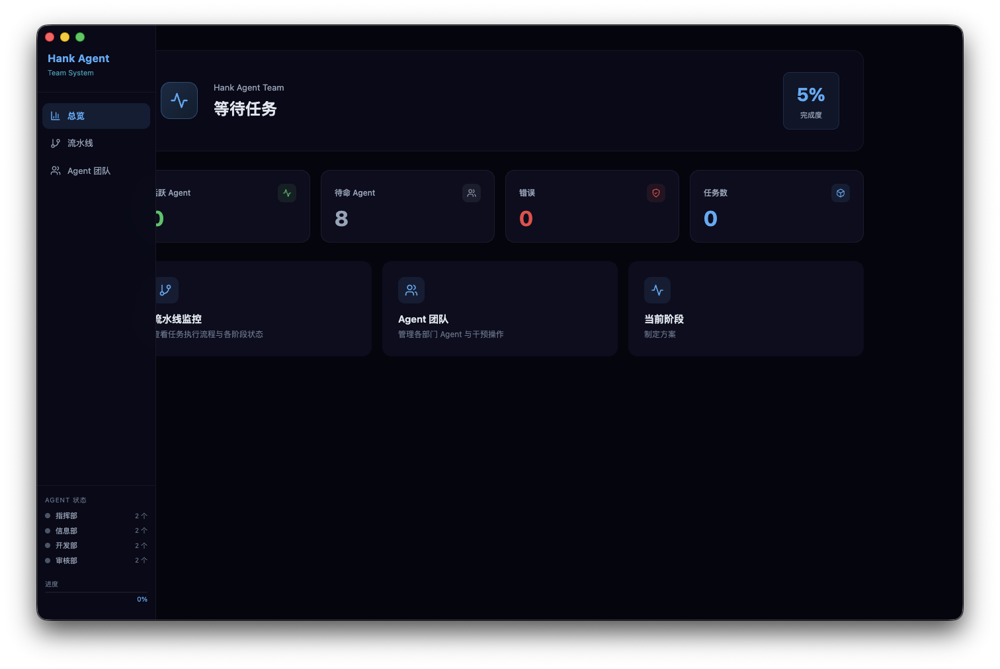
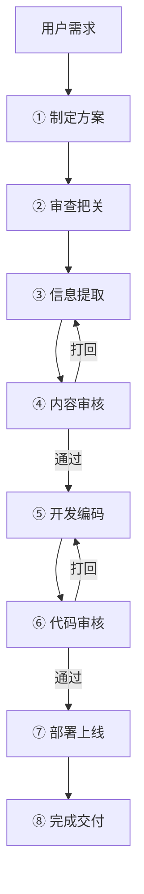

<div align="center">



# Hank Agent Team

**AI 驱动的四部门协作流水线引擎**

[](https://opensource.org/licenses/MIT)
[](https://www.typescriptlang.org/)
[](https://react.dev/)
[](https://vitejs.dev/)
[](https://www.electronjs.org/)
[](https://tailwindcss.com/)
[](https://github.com/Hank-create519/Hank-Agent-Team/pulls)

</div>

---

<p align="center">
  <a href="#-这是什么">介绍</a> ·
  <a href="#-界面预览">预览</a> ·
  <a href="#-核心机制">机制</a> ·
  <a href="#-安全机制">安全</a> ·
  <a href="#-技术栈">技术栈</a> ·
  <a href="#-快速开始">快速开始</a> ·
  <a href="#-项目结构">结构</a>
</p>

---

## 这是什么

Hank Agent Team 是一个桌面端 AI 团队模拟器——你把需求扔进去，四个 AI 部门（指挥部、信息部、开发部、审核部）自动分工协作，经历 8 个标准化阶段，最终交付可部署的成果。

**不是 ChatBot 套壳。** 它模拟了真实软件团队的**分工、审查、打回、重试**机制。

> 「假设有罪 + 对抗出真知」——每个方案在被证明可靠之前，默认存在漏洞。

---

## 界面预览

<div align="center">
  
  
</div>

---

## 核心机制

### 四部门

| 部门 | 代号 | 职责 |
|------|------|------|
| 指挥部 | `command` | 制定方案、最终交付 |
| 信息部 | `info` | 信息提取、需求分析 |
| 开发部 | `develop` | 编码实现、部署上线 |
| 审核部 | `review` | 内容审核、代码审查 |

### 八阶段流水线



- **双重打回**：内容审核 + 代码审核各独立计数，每阶段最多 3 轮，超限自动暂停
- **失败重试**：部署阶段失败自动重试 1 次
- **实时监控**：Communication 总线全局追踪部门间通信

---

## 安全机制

五层纵深防御，按部门控制可调用工具：

| 层级 | 名称 | 策略 |
|:---:|------|------|
| L1 | 工具白名单 | 按 `command / info / develop / review` 部门分配工具权限 |
| L2 | 速率限制 | 单轮 5 次调用、全 Session 50 次上限、间隔 ≥ 1 秒 |
| L3 | 参数校验 | URL 禁内网 IP、路径排除 `/System /Library` 等敏感目录 |
| L4 | 沙箱执行 | 子进程安全包装，隔离文件系统操作 |
| L5 | 结果清洗 | 密钥正则过滤 + 单次输出 8000 字符截断 |

---

## 多协议 LLM

47 个预置模型覆盖 14 家厂商，Agent 级独立配置 API Key：

| Provider | 端点 | 认证方式 |
|----------|------|----------|
| OpenAI | `/v1/chat/completions` | Bearer Token |
| Anthropic | `/v1/messages` | `x-api-key` |
| Google | `/v1beta/models/:model:generateContent` | API Key |
| DeepSeek | `/v1/chat/completions` | Bearer Token |
| 混元 / 通义千问 / 豆包 / Moonshot 等 | 兼容 OpenAI 协议 | Bearer Token |

无 API Key 时自动降级 Mock 模式，不阻塞流程验证。

---

## 技术栈

| 类别 | 技术 |
|------|------|
| 语言 | TypeScript 5.3 |
| UI 框架 | React 18 |
| 构建工具 | Vite 5 |
| CSS | Tailwind CSS 3 |
| 桌面壳 | Electron 28 |
| 图标 | Lucide React |

---

## 快速开始

```bash
git clone https://github.com/Hank-create519/Hank-Agent-Team.git
cd Hank-Agent-Team
npm install

# 浏览器开发模式
npm run dev

# 生产构建 + Electron 桌面打包
npm run build
node build/build.mjs
```

---

## 项目结构

```
src/
├── core/                        # 引擎核心 (~2800 行)
│   ├── Engine.ts                # startPipeline + ReviewEngine 类 + subscribe + on/emit
│   ├── Pipeline.ts              # 8 阶段定义 + 初始状态工厂
│   ├── llm.ts                   # 多协议路由 + callAIWithTools 工具循环 (15 轮上限)
│   ├── safetyGuard.ts           # L1~L5 五层安全校验
│   ├── mockResponses.ts         # Mock 降级数据
│   ├── types.ts                 # 类型定义 (Agent / PipelineState / LogEntry ...)
│   └── Communication.ts         # 部门通信总线
├── agents/agentConfig.ts        # 四部门 + 47 模型注册表
├── ui/
│   ├── pages/                   # Dashboard / PipelineView / AgentsPanel
│   └── components/              # Sidebar / LogStream
└── deploy/Deployer.ts           # 部署模块
```

---

## 持久化

```typescript
import { engine } from './core/Engine';

engine.setPersistHandler(async (action, payload) => {
  if (action === 'stageOutputs') await db.save('outputs', payload);
});
```

通过 `setPersistHandler` 注入自定义持久化逻辑（IndexedDB / SQL.js / 本地文件），引擎在流水线状态变更时自动回调。

---

## License

MIT © 2026 Hank个人工作室

---

<p align="center">
  <sub>Built with ❤️ by <a href="https://github.com/Hank-create519">Hank-create519</a></sub>
</p>
