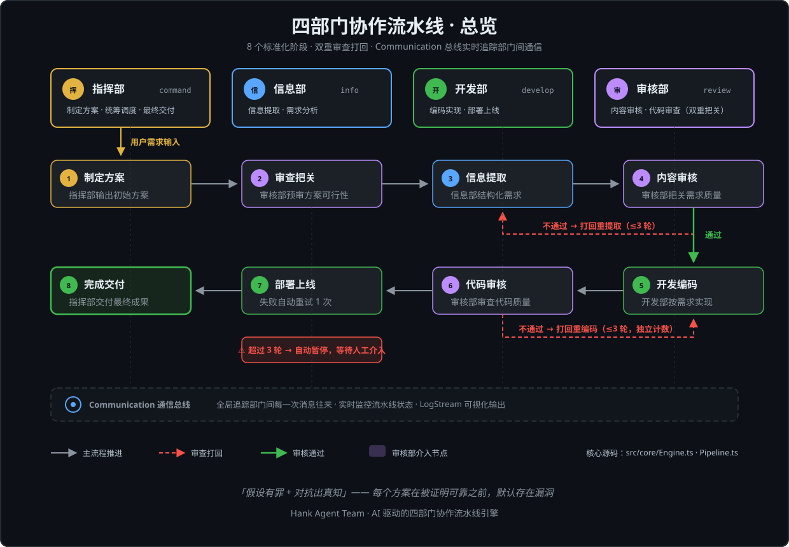
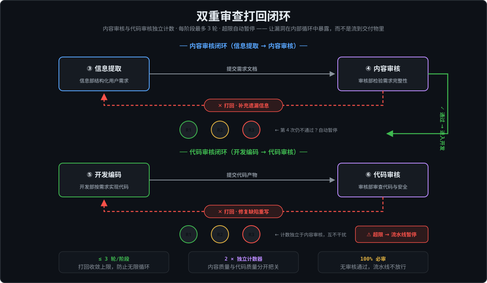
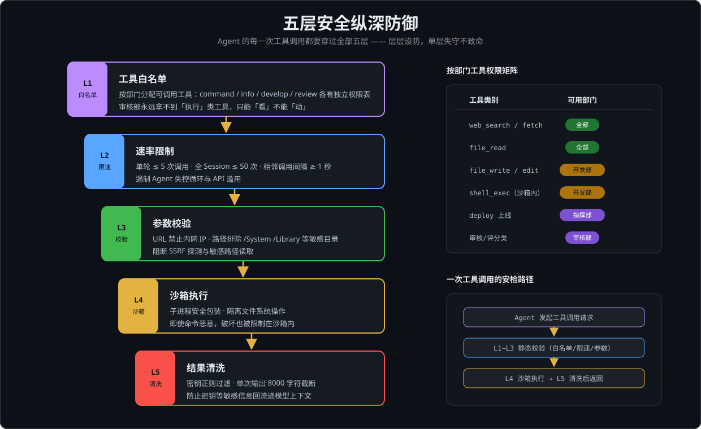
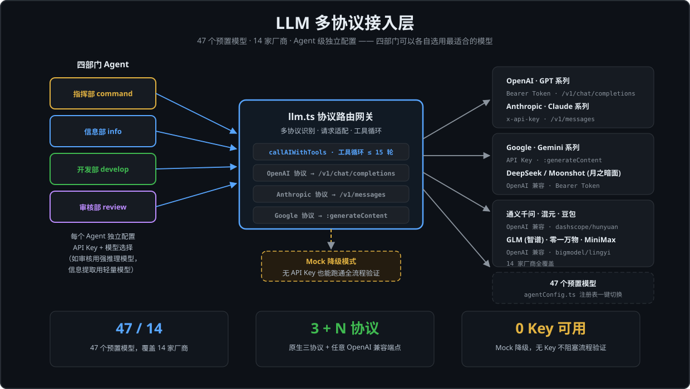

<div align="center">

# Hank Agent Team

**AI 驱动的四部门协作流水线引擎**

[](./LICENSE)
[](https://www.typescriptlang.org/)
[](https://react.dev/)
[](https://www.electronjs.org/)

**桌面端 AI 团队模拟器**——把需求交给四个 AI 部门（指挥部 / 信息部 / 开发部 / 审核部），它们自动分工协作，经历 8 个标准化阶段，双重审查打回，最终交付可部署的成果。

**不是 ChatBot 套壳**——它模拟了真实软件团队的分工、审查、打回、重试机制。

</div>

---

## 📦 下载安装

前往 [**Releases**](https://github.com/Hank-create519/Hank-Agent-Team/releases) 下载最新版本：

| 平台 | 格式 |
|------|------|
| Windows | NSIS 安装包（.exe）/ 便携版（portable .exe） |
| macOS | .dmg |

> 应用内置自动更新（electron-updater），新版本发布后可直接在应用内升级。

## 🗂 仓库结构

| 目录 | 说明 |
|------|------|
| [`win/`](./win) | **当前主版本**——完整的最新源码、Windows/macOS 双平台构建（electron-builder），[详细文档 →](./win/README.md) |
| [`mac/`](./mac) | 早期 macOS 版本快照（`scripts/pack.js` 打包时代的存档），[文档 →](./mac/README.md) |

## ✨ 核心特性（一览）

- **四部门协作**：指挥部（制定方案）、信息部（需求分析）、开发部（编码部署）、审核部（双重审查），部门间通过 Communication 总线实时通信
- **八阶段流水线**：制定方案 → 审查把关 → 信息提取 → 内容审核 → 开发编码 → 代码审核 → 部署上线 → 完成交付；内容与代码审核独立打回，每阶段最多 3 轮
- **五层安全防御**（L1 工具白名单 / L2 速率限制 / L3 参数校验 / L4 沙箱执行 / L5 结果清洗），按部门分配工具权限
- **47 个预置模型**：覆盖 OpenAI、Anthropic、Google、DeepSeek、通义千问、混元、豆包、Moonshot 等 14 家厂商，Agent 级独立配置；无 Key 自动降级 Mock 模式

完整介绍（界面预览、机制详解、安全说明、构建指南）见 **[win/README.md](./win/README.md)**。

## 🏗 架构一览

<div align="center">

**四部门流水线总览** —— 8 阶段主流程、双重打回、通信总线，一张图看懂运作逻辑



<br/>

**审查打回闭环** —— 内容审核与代码审核独立计数，每阶段最多 3 轮，超限自动暂停



<br/>

**五层安全纵深防御** —— Agent 的每一次工具调用都要穿过全部五层



<br/>

**LLM 多协议接入层** —— 47 个预置模型 / 14 家厂商，Agent 级独立配置，无 Key 降级 Mock



</div>

## 🚀 快速开始

```bash
git clone https://github.com/Hank-create519/Hank-Agent-Team.git
cd Hank-Agent-Team/win
npm install
npm run dev        # 开发模式：Vite + Electron
npm run dist:win   # 打包 Windows 安装包（输出 release/）
npm run dist:mac   # 打包 macOS .dmg
```

## 📄 License

[MIT](./LICENSE) © 2026 Hank
