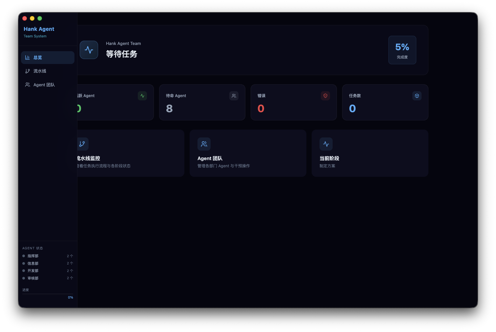
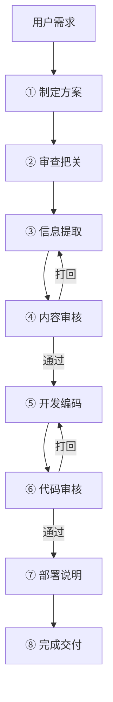

<div align="center">



# Hank Agent Team

**AI 驱动的四部门协作流水线引擎**

[](https://opensource.org/licenses/MIT)
[](https://www.typescriptlang.org/)
[](https://react.dev/)
[](https://vitejs.dev/)
[](https://www.electronjs.org/)
[](https://tailwindcss.com/)
[](https://github.com/Hank-create519/Hank-Agent-Team/pulls)

</div>

---

<p align="center">
  <a href="#-这是什么">介绍</a> ·
  <a href="#-界面预览">预览</a> ·
  <a href="#-核心机制">机制</a> ·
  <a href="#-安全机制">安全</a> ·
  <a href="#-技术栈">技术栈</a> ·
  <a href="#-快速开始">快速开始</a> ·
  <a href="#-windows-构建与运行">Windows 构建</a> ·
  <a href="#-项目结构">结构</a>
</p>

---

## 这是什么

Hank Agent Team 是我做的 Electron 桌面多 Agent 协作流程原型。它把需求拆成计划、信息提取、审核、开发产出和交付等阶段；指挥部、信息部、开发部和审核部各自负责一段，流程状态和审核意见都能在界面里查看。

我做它主要是想试试：不同职责的 Agent 按一条流程接力时，任务能不能更容易追踪，遇到问题也能停下来处理。当前主流程生成文字和审核记录；它不会自动把代码写入用户指定的项目目录，部署阶段只生成操作说明，不会实际运行部署。

没有 API Key 时，可以用带有 demo 标记的模拟输出体验流程。真实调用失败会暂停等待处理，不会用演示结果冒充真实结果。

---

## 界面预览

<div align="center">
  
  
</div>

---

## 核心机制


### 四部门

| 部门 | 代号 | 职责 |
|------|------|------|
| 指挥部 | `command` | 制定方案、最终交付 |
| 信息部 | `info` | 信息提取、需求分析 |
| 开发部 | `develop` | 编码实现、部署说明 |
| 审核部 | `review` | 内容审核、代码审查 |

### 八阶段流水线



- **双重打回**：内容审核 + 代码审核各独立计数，每阶段最多 3 轮，超限自动暂停
- **失败处理**：真实 API 调用失败时暂停，等待手动重试或停止；部署阶段只生成说明，不运行部署命令
- **实时监控**：Communication 总线全局追踪部门间通信

### 审查打回闭环


---

## 安全机制

五层纵深防御，按部门控制可调用工具：


| 层级 | 名称 | 策略 |
|:---:|------|------|
| L1 | 工具白名单 | 按 `command / info / develop / review` 部门分配工具权限 |
| L2 | 速率限制 | 单轮 5 次调用、全 Session 50 次上限、间隔 ≥ 1 秒 |
| L3 | 参数校验 | URL 禁内网 IP、路径排除 `/System /Library` 等敏感目录 |
| L4 | 执行边界 | 有 Python 输入检查与子进程包装；主流程尚未接入真实工作区工具执行，不代表完整文件系统沙箱 |
| L5 | 结果清洗 | 密钥正则过滤 + 单次输出 8000 字符截断 |

---

## 多协议 LLM

47 个预置模型覆盖 14 家厂商，Agent 级独立配置 API Key：


| Provider | 端点 | 认证方式 |
|----------|------|----------|
| OpenAI | `/v1/chat/completions` | Bearer Token |
| Anthropic | `/v1/messages` | `x-api-key` |
| Google | `/v1beta/models/:model:generateContent` | API Key |
| DeepSeek | `/v1/chat/completions` | Bearer Token |
| 混元 / 通义千问 / 豆包 / Moonshot 等 | 兼容 OpenAI 协议 | Bearer Token |

无 API Key 时自动降级 Mock 模式，不阻塞流程验证。

---

## 技术栈

| 类别 | 技术 |
|------|------|
| 语言 | TypeScript 5.3 |
| UI 框架 | React 18 |
| 构建工具 | Vite 5 |
| CSS | Tailwind CSS 3 |
| 桌面壳 | Electron 28（跨平台：Windows / macOS） |
| 图标 | Lucide React |

---

## 快速开始

### 通用（macOS / Windows / Linux 同样适用）

```bash
git clone https://github.com/Hank-create519/Hank-Agent-Team.git
cd Hank-Agent-Team
npm install

# 开发模式：同时启动 Vite 开发服务器与 Electron 桌面窗口
npm run dev

# 仅构建渲染层（输出到 dist/）
npm run build
```

> 提示：旧版 `scripts/pack.js`（依赖桌面已存在的 .app 与 $HOME 的 macOS 专属打包脚本）已移除，
> 统一改用 electron-builder 跨平台打包（见下方「Windows 构建与运行」）。

---

## Windows 构建与运行

本项目已支持 **Windows**（无边框自定义标题栏 `frame:false` + 右上角最小化 / 最大化 / 关闭系统控制按钮，顶栏可整体拖拽），
同时保留 **macOS** 的 `hiddenInset` 标题栏 + `vibrancy` 毛玻璃质感。

```bash
# 1. 安装依赖
npm install

# 2. 开发模式（Windows 下为无边框窗口，可拖拽顶栏、点击右上角控件）
npm run dev

# 3. 打包 Windows 安装包（输出在 release/）
npm run dist:win        # 产出 NSIS 安装包(.exe) 与 便携版(portable .exe)

# 4.（可选）打包 macOS
npm run dist:mac        # 产出 .dmg
```

> 说明：
> - `npm run dist:win` 会先自动执行 `npm run build`（Vite 渲染层构建），再由 electron-builder 打包；
>   主进程 `electron-main.js` / `preload.js` 不经 Vite，由 electron-builder 直接拷贝进安装包（见 package.json 的 `build.files`）。
> - 打包配置见 `package.json` 的 `build` 字段：`appId`、`productName`、输出目录 `release/`、NSIS 允许自定义安装路径等。
> - 若需要自定义应用图标，将 `icon.ico` 放入 `assets/` 目录，并在 `build.win.icon` 中指定即可（当前未内置图标，使用 electron-builder 默认图标）。

---

## 项目结构

```
src/
├── core/                        # 引擎核心 (~2800 行)
│   ├── Engine.ts                # startPipeline + ReviewEngine 类 + subscribe + on/emit
│   ├── Pipeline.ts              # 8 阶段定义 + 初始状态工厂
│   ├── llm.ts                   # 多协议路由 + callAIWithTools 工具循环 (15 轮上限)
│   ├── safetyGuard.ts           # L1~L5 五层安全校验
│   ├── mockResponses.ts         # Mock 降级数据
│   ├── types.ts                 # 类型定义 (Agent / PipelineState / LogEntry ...)
│   └── Communication.ts         # 部门通信总线
├── agents/agentConfig.ts        # 四部门 + 47 模型注册表
├── ui/
│   ├── pages/                   # Dashboard / PipelineView / AgentsPanel
│   └── components/              # Sidebar / LogStream
└── deploy/Deployer.ts           # 部署模块
```

---

## 持久化

```typescript
import { engine } from './core/Engine';

engine.setPersistHandler(async (action, payload) => {
  if (action === 'stageOutputs') await db.save('outputs', payload);
});
```

通过 `setPersistHandler` 注入自定义持久化逻辑（IndexedDB / SQL.js / 本地文件），引擎在流水线状态变更时自动回调。

---

## License

MIT © 2026 Hank个人工作室

---

<p align="center">
  <sub>Built with ❤️ by <a href="https://github.com/Hank-create519">Hank-create519</a></sub>
</p>
